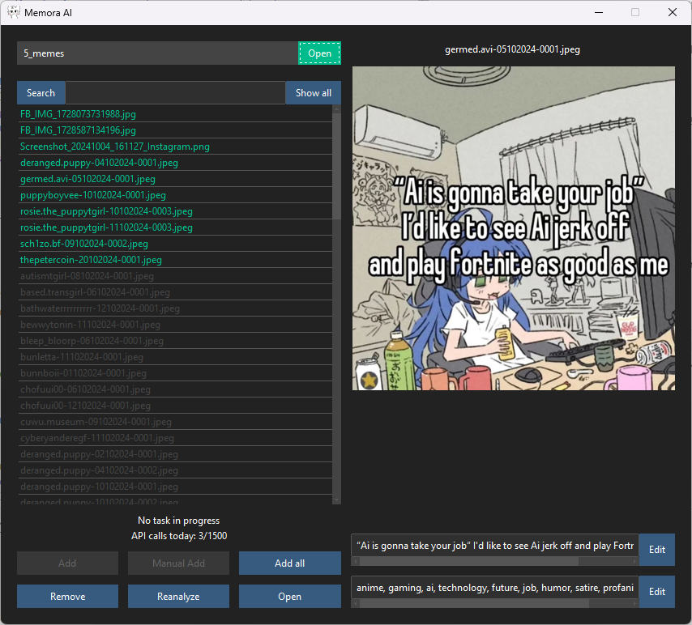

# Memora AI

An image database that uses the Google's Gemini AI to analyze your memes and make them searchable based on any text in the image and a set of tags the image is assigned.



### Features
- Metadata stored in a central json file for each database, avoiding the use of sidecar files.
- Search implemented with fuzzy token-matching, providing very high levels of recall.
- Counter to keep track of your daily gemini request limit.
- Option to manually add an image without the use of AI.
- Option to process large batches of images with a single click, without making more requests to the ai than your "per day" or "per minute" request limit.
- Option to have the AI reanalyze an image.
- Option to manually edit the image-text and tags generated by the AI.

## Installation
1. **Download**: 
    - Get the latest release from the [Releases page](https://github.com/OliviaJespersen/Memora-AI/releases).
2. **Setup Config File**:
    - Find the config file at `\Memora AI\_internal\config\config.json` and set it up as shown below.
3. **Run the App**: 
    - **Windows**: Launch the program by double-clicking the executable `Memora AI.exe`. 

### Configuration
When you first open the config file you will be presented with a default configuration:
```json
{
    "api_key": "Your Gemini API key goes here",
    "theme": "darkly",
    "auto_clean": true
}
```
> [!CAUTION]
> The API key **CANNOT** be left as the default value and must be set.

**Options**:
- `api_key`: Your Gemini API key. You can set up one [here](https://aistudio.google.com/apikey).
- `theme`: The theme the program will be launched with. For a full list see the [ttkbootstrap documentation](https://ttkbootstrap.readthedocs.io/en/latest/themes/).
- `auto_clean`: Decides wether or not the database will be cleaned of entries that are corrupted or no longer in the database directory.
